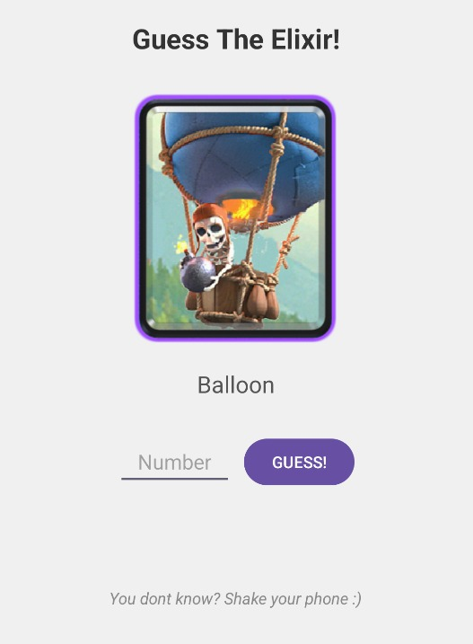
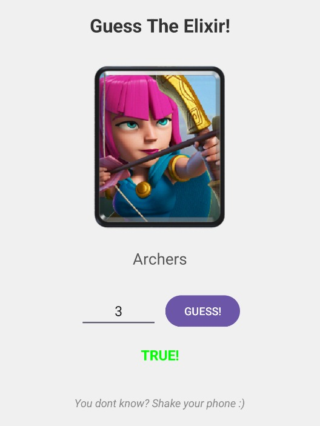
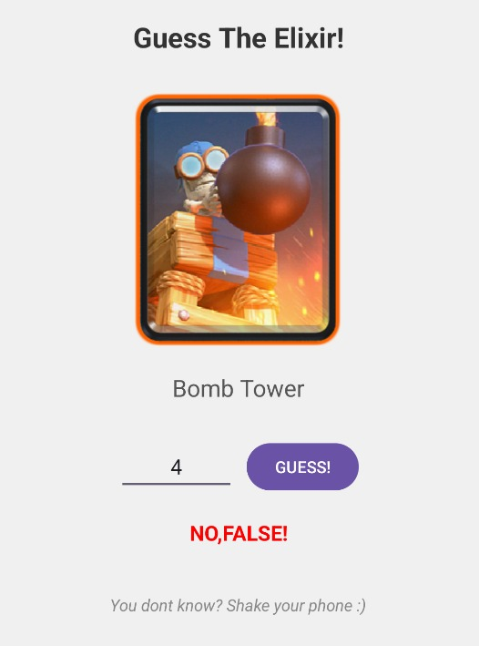

<div align="center">

#  Clash Royale - Elixir Guess Game


<br />

**Mobile Systems Course Final Project** 

*Enter the elixir costs, test your knowledge, and shake to skip!*

</div>

---

## Project Overview
This is an interactive Android game developed for the **Mobile Systems** course at Bialystok University of Technology. The main goal is to guess the "Elixir" cost of Clash Royale cards fetched dynamically from the internet.

> **Simple Logic:** See the card -> Guess the cost -> Shake if you don't know!

---

## Key Features (Requirements)

| Feature | Status | Technology Used |
| :--- | :---: | :--- |
| **Sensors** | ✅ | `Accelerometer` (Shake Detection) |
| **API Integration** | ✅ | `Retrofit` + Custom GitHub Gist API |
| **External Library** | ✅ | `Glide` (Image Loading) |

---

## Technical Implementation

### 1. Shake Detection (Sensors) 
The app monitors the **Accelerometer** sensor values (`x, y, z`).
- It calculates the `g-force` / speed of the movement.
- If the speed exceeds the `SHAKE_THRESHOLD`, the app automatically **skips to the next question**.

### 2. Custom API & Networking 
Instead of a static database, the app fetches data online:
- **Data Source:** A custom `JSON` file hosted on GitHub Gist.
- **Images:** High-quality PNG assets hosted on a separate GitHub Repository.
- **Library:** `Retrofit 2` is used for handling HTTP requests and JSON parsing (`GSON`).

### 3. Image Handling 
- **Library:** `Glide` is used to load images asynchronously.
- It handles caching and resizing automatically to ensure smooth performance.

---

## In Game Screenshots

| Start Screen | Correct Answer | Wrong Answer |
|:---:|:---:|:---:|
|  |  |  |


---

## How to Run?
1. Clone this repository:
   ```bash
   git clone [https://github.com/sem1hhh/CR_Guess_Game.git)
2. Open the project in Android Studio.
3. Sync Gradle files.
4. Run on an Emulator or Real Device (Shake feature requires a real device or sensor simulation).  
